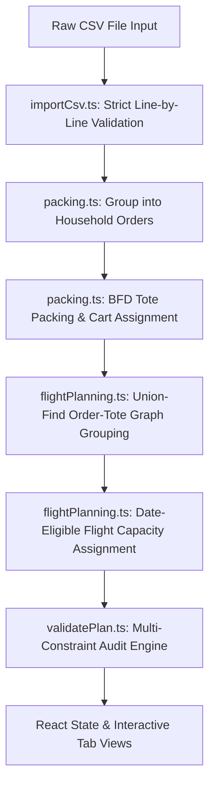

# ZAMIIGO Northern Community Logistics Engine — Team & AI Architecture Guide

Welcome to the **ZAMIIGO Cargo Logistics Engine** developer reference. This document is designed for human software engineers and AI coding assistants collaborating on this repository. It outlines the domain model, key invariants, mathematical heuristics, system architecture, file map, and development guidelines.

---

## 🚀 1. Project Context & Mission

**The Problem:** Northern Ontario Indigenous communities like Webequie First Nation (CYWP) rely on seasonal ice roads and air cargo for food and supplies. Air freight from regional hubs like Nakina (CYQN) using **Cessna 208 Caravan** aircraft is strictly constrained by payload weight, cargo volume, tote dimensions, and departure dates.

**The Solution:** ZAMIIGO bridges consumer grocery orders (Real Canadian Superstore) with Wilderness North bush aviation operations. The application guarantees:
- **Zero Household Order Splitting:** An entire household order (and any orders sharing returnable totes) travels together on a single flight departure.
- **2D/3D Tote Physical Envelope Verification:** Items are packed into returnable totes using Best-Fit Decreasing (BFD) with orientation verification.
- **Aircraft Space Accounting:** Aircraft hold utilization is computed using physical tote footprints, not theoretical raw item volumes.
- **Live Auditing & Constraint Checking:** Operational invariants are continuously audited across picking carts, totes, flights, and dates.
- **AI-Assisted Dispatch Briefings:** Uses Gemini 3 Flash via a serverless proxy for operational flight briefings with deterministic fallback.

---

## 🔒 2. Core Domain Invariants (NON-NEGOTIABLE)

When making any code or algorithmic changes, **the following rules must NEVER be broken**:

| Invariant Rule | Implementation / Description | Target File |
| :--- | :--- | :--- |
| **Atomic Whole-Order Flight Assignment** | An order is NEVER split across multiple flights. All totes belonging to an order (and all orders sharing a tote) are assigned to the same departure. | [`src/lib/flightPlanning.ts`](file:///Users/kushmakani/Desktop/hackathon/src/lib/flightPlanning.ts) |
| **Split-Order Cart Guard** | All totes for a multi-tote order MUST stay on the same picker cart. Moving a tote to another cart moves the entire order's totes together. | [`src/lib/buildPlan.ts`](file:///Users/kushmakani/Desktop/hackathon/src/lib/buildPlan.ts) |
| **Date Eligibility Enforcement** | An order is only eligible for departure if `order_date <= departure_date`. Orders are never flown before their creation date. | [`src/lib/flightPlanning.ts`](file:///Users/kushmakani/Desktop/hackathon/src/lib/flightPlanning.ts) |
| **Aircraft Tote Space Footprint** | Aircraft hold volume utilization is calculated as `assigned_tote_count * tote_volume` ($2.083\text{ cu ft}$), NOT raw item volume sum. | [`src/lib/flightPlanning.ts`](file:///Users/kushmakani/Desktop/hackathon/src/lib/flightPlanning.ts) |
| **Oversized Item Preservation** | Unpackable items (exceeding $23.5" \times 14.0" \times 11.0"$ or single-item weight limits) are preserved in `all_items` and flagged in `unpackableItems`. They are never silently deleted. | [`src/lib/packing.ts`](file:///Users/kushmakani/Desktop/hackathon/src/lib/packing.ts) |
| **Hardened CSV Validation** | All 3 dimensions (`length_in`, `width_in`, `height_in`) must be present if any is specified. Non-positive values block file load with actionable line-by-line feedback. | [`src/lib/importCsv.ts`](file:///Users/kushmakani/Desktop/hackathon/src/lib/importCsv.ts) |
| **Deterministic Fallback** | Gemini AI calls use a 10-second timeout and proxy via `/api/dispatch`. If API limit or network error occurs, the system renders a deterministic operational brief seamlessly. | [`src/lib/geminiAssistant.ts`](file:///Users/kushmakani/Desktop/hackathon/src/lib/geminiAssistant.ts) |

---

## 🏗️ 3. Technical Architecture & File Map

The codebase is organized into distinct domain layers:

```
src/
├── lib/                        # Domain Business Logic & Algorithmic Core
│   ├── types.ts                # Single Source of Truth for Data Schemas
│   ├── importCsv.ts            # CSV Parser with Strict Validation
│   ├── packing.ts              # Best-Fit Decreasing Tote & Cart Packing
│   ├── flightPlanning.ts       # Atomic Order Grouping & Flight Load Planner
│   ├── buildPlan.ts            # Master Pipeline Orchestrator
│   ├── validatePlan.ts         # Live Audit & Rule Engine
│   ├── geminiAssistant.ts      # Gemini AI Dispatch Brief Generator
│   └── retailerExport.ts       # Superstore Format Exporter
│
├── components/                 # Application UI Components
│   ├── Header.tsx              # Brand Header & Dataset / Modal Triggers
│   ├── CsvUploadModal.tsx      # CSV Import Modal (Orders & Capacity)
│   ├── HandheldPickerModal.tsx # Mobile Scanner View for Warehouse Crew
│   ├── SettingsModal.tsx       # Live System Health Ledger & Limit Controls
│   └── tabs/                   # Primary Application Views
│       ├── OrderEntryTab.tsx   # Tab 1: Retailer Staging & Oversized Alerts
│       ├── OrderPickingTab.tsx # Tab 2: Picker Carts & Tote Packing Fill
│       └── FlightPlannerTab.tsx# Tab 3: Cessna 208 Flight Load & Briefing
│
├── App.tsx                     # Top-level React State Provider
├── index.css                   # Tailwind Base Directives & Print Styles
└── main.tsx                    # React Entrypoint

api/
└── dispatch.ts                 # Vercel Serverless Function Proxy for Gemini API
```

---

## 📊 4. Core Data Flow Pipeline



### Key Data Interfaces ([`src/lib/types.ts`](file:///Users/kushmakani/Desktop/hackathon/src/lib/types.ts))

- **`LineItem`**: Raw item row with SKU, product name, weight, dimensions, order date, household ID.
- **`HouseholdOrder`**: Aggregated order containing `items[]` (packable), `all_items[]` (complete original items), total weight, total volume, assigned totes, and flight status.
- **`Tote`**: Physical returnable container ($23.5" \times 14" \times 11"$, $3,600\text{ cu in}$, default $50\text{ lb}$ limit) containing items, fill %, assigned cart, and assigned flight.
- **`PickerCart`**: Superstore cart containing $3$ to $8$ totes.
- **`FlightDeparture`**: Cessna 208 flight instance with tote slots, payload capacity, tote-footprint volume, assigned orders, and binding constraint metrics.
- **`PlanState`**: Complete immutable application snapshot passed down to tabs.

---

## 🤖 5. Guidelines for Team Members Prompting AI

When using AI assistants (Claude, GPT, Gemini) to add features or refactor code in this repo, follow these instructions:

1. **Provide Context:** Always reference [`src/lib/types.ts`](file:///Users/kushmakani/Desktop/hackathon/src/lib/types.ts) and the relevant module in [`src/lib/`](file:///Users/kushmakani/Desktop/hackathon/src/lib/).
2. **Enforce Invariants:** Ask the AI to verify that no household orders are split across flights or carts.
3. **Never Remove Safety Audits:** Do not allow AI to delete or bypass validation rules in [`src/lib/validatePlan.ts`](file:///Users/kushmakani/Desktop/hackathon/src/lib/validatePlan.ts).
4. **Keep Business Logic Decoupled:** Keep calculation logic inside `src/lib/` and keep React component files focused strictly on UI rendering and interaction handlers.
5. **Run Verification:** After any edits, always run `npm run build` to verify TypeScript type-checking and bundling.

---

## 🛠️ 6. Local Development & Deployment Command Reference

```bash
# Install dependencies
npm install

# Run dev server with hot reload
npm run dev

# Run full TypeScript & Vite production build check
npm run build

# Push to GitHub main branch
git push origin main
```

---

## 📄 License & Attribution
Designed & built for the **Wilderness North × Zamiigo Cargo Logistics Hackathon**.
